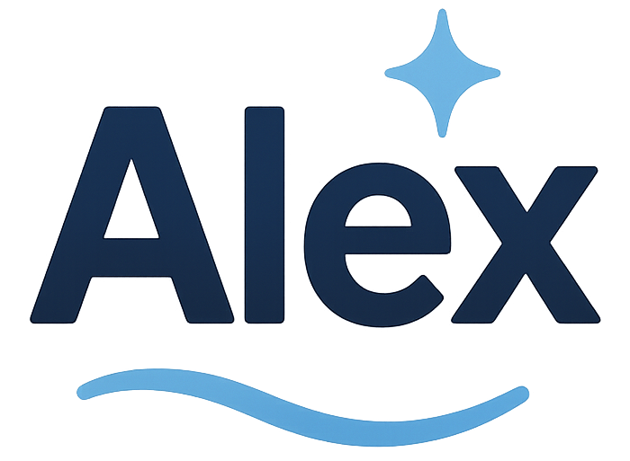

<p align="center">
  
</p>

# Alex MCP Proxy

MCP proxy client to connect GitHub Copilot and Claude Desktop to Alex, the Business Central AL code assistant.

## 🎯 What is Alex?

Alex is an AI assistant specialized in Microsoft Dynamics 365 Business Central AL code. It helps you understand, debug, and develop AL code more efficiently.

**🔗 Links:**
- **Web App**: [https://alex.app.pmats.ai](https://alex.app.pmats.ai)
- **Documentation**: [https://alex.app.pmats.ai/docs/](https://alex.app.pmats.ai/docs/)

This guide shows you how to install Alex MCP proxy in **GitHub Copilot** (VS Code) or **Claude Desktop**.

## 🤔 What is MCP?

**MCP (Model Context Protocol)** is an open standard that allows AI assistants like GitHub Copilot or Claude Desktop to connect to external knowledge sources and tools.

Think of MCP as a **universal plug** that lets your AI assistant access specialized knowledge bases, APIs, or services. Instead of relying only on its training data, the AI can fetch real-time, accurate information from external sources.

**In the case of Alex:**
- Your AI assistant (Copilot or Claude) asks questions about Business Central
- The MCP proxy forwards requests to the Alex backend
- Alex searches its Business Central AL code knowledge base
- The answer is returned to your AI assistant
- You get accurate, up-to-date information about Business Central AL code

**Benefits:**
- ✅ **Specialized knowledge** - Alex knows Business Central AL code in depth
- ✅ **Always up-to-date** - Information comes from the latest BC versions
- ✅ **Version comparisons** - Compare code across BC versions (26, 27, etc.)
- ✅ **Secure** - Your API key keeps your queries private

## 🔧 Available MCP Tools

Alex exposes two MCP tools for AI assistants:

### `alex_al_query`

**Purpose:** Query the Business Central AL code knowledge base

**Input Schema:**
```json
{
  "request": "string (required)"
}
```

**Usage:**
- Answer questions about Business Central AL code
- Explain how tables, codeunits, pages work
- Provide code examples and best practices
- Search for specific AL objects or procedures

**Examples:**
- `{"request": "How does the Customer table work in Business Central?"}`
- `{"request": "Show me an example of a codeunit that posts a sales order"}`
- `{"request": "What events are available in the Sales Header table?"}`

### `alex_al_comparison`

**Purpose:** Compare Business Central AL code between different versions

**Input Schema:**
```json
{
  "request": "string (required)"
}
```

**Usage:**
- Compare AL objects across BC versions (e.g., v26 vs v27)
- Identify breaking changes between versions
- Discover new fields, procedures, or events added
- Track evolution of specific AL objects

**Examples:**
- `{"request": "What changed in table Customer between versions 26 and 27?"}`
- `{"request": "Compare the Sales Order page in BC 25 vs BC 26"}`
- `{"request": "Show me new procedures added to Codeunit 80 in version 27"}`

**Note:** Both tools automatically detect the user's intent and route to the appropriate backend endpoint.

## 🚀 Installation

### Prerequisites

**1. Get the Code**

Clone or fork this repository:

```bash
# Clone (recommended for users)
git clone https://github.com/pmoisontech/Alex-MCP-Proxy.git
cd Alex-MCP-Proxy

# Or fork (if you want to contribute)
# 1. Click "Fork" on GitHub
# 2. Clone your fork:
git clone https://github.com/YOUR-USERNAME/Alex-MCP-Proxy.git
cd Alex-MCP-Proxy
```

**2. Node.js Requirement**

Node.js 18 or later is required. The installer can install it automatically if missing.

### Automatic Installation (Recommended)

**Windows PowerShell:**
```powershell
cd mcp-server-proxy
.\install-mcp.ps1
```

**Linux / macOS / WSL:**
```bash
cd mcp-server-proxy
./install-mcp.sh
```

The installer will guide you through the complete setup:
- ✅ Install Node.js if needed
- ✅ Connect to your Alex account
- ✅ Configure GitHub Copilot (VS Code) or Claude Desktop
- ✅ Test the connection

After installation, restart VS Code or Claude Desktop to activate Alex.

#### Command-Line Parameters (Advanced)

For automated/scripted installations:

**Linux / macOS / WSL:**
```bash
./install-mcp.sh --url URL --username USER --password PASS [--expiration-date DATE] [--vscode] [--claude]
```

**Windows PowerShell:**
```powershell
.\install-mcp.ps1 -Url URL -Username USER -Password PASS [-ExpirationDate DATE] [-VSCode] [-Claude]
```

**Available Parameters:**

| Parameter | Description | Default |
|-----------|-------------|---------|
| `--url` / `-Url` | Backend API URL | `https://alex.api.pmats.ai` |
| `--username` / `-Username` | Alex account username | (required in automated mode) |
| `--password` / `-Password` | Alex account password | (required in automated mode) |
| `--expiration-date` / `-ExpirationDate` | API key expiration (ISO 8601 UTC format) | Today + 3 months |
| `--vscode` / `-VSCode` | Configure VS Code (GitHub Copilot) | Interactive prompt |
| `--claude` / `-Claude` | Configure Claude Desktop | Interactive prompt |
| `--help` / `-Help` | Show help message | - |

**Example - Automated Installation:**
```bash
./install-mcp.sh \
  --username john@example.com \
  --password MySecurePassword \
  --expiration-date "2026-06-30T23:59:59Z" \
  --vscode
```

**Note:** Expiration date format must be ISO 8601 UTC: `YYYY-MM-DDTHH:MM:SSZ`

### Manual Installation

If you prefer to configure manually:

#### 1. Install Node.js

Make sure Node.js 18 or later is installed on your computer.

#### 2. Install Dependencies

```bash
cd mcp-server-proxy
npm install
```

#### 3. Get Your API Key

Connect to Alex and obtain your personal API key. The key looks like `sk_live_xxxxx`.

**⚠️ Keep your API key secret!** It gives access to your Alex account.

#### 4. Configure GitHub Copilot (VS Code)

Create or edit the file:

**Windows**: `%APPDATA%\Code\User\mcp.json`  
**Linux/macOS**: `~/.config/Code/User/mcp.json`

Add this configuration:

```json
{
  "mcpServers": {
    "alex": {
      "command": "node",
      "args": [
        "/ABSOLUTE/PATH/to/mcp-server-proxy/mcp-proxy-client.js"
      ],
      "env": {
        "ALEX_API_URL": "https://alex.api.pmats.ai",
        "ALEX_API_KEY": "sk_live_xxxxx",
        "MCP_CLIENT_NAME": "github_copilot"
      }
    }
  }
}
```

**⚠️ Important**: 
- Replace `/ABSOLUTE/PATH/to/` with the real path on your computer
- Replace `sk_live_xxxxx` with your personal API key
- `MCP_CLIENT_NAME` helps track which client is being used (github_copilot, cursor, windsurf, vscode, etc.)
- Restart VS Code after saving

#### 5. Configure Claude Desktop

Create or edit the file:

**Windows**: `%APPDATA%\Claude\claude_desktop_config.json`  
**macOS**: `~/Library/Application Support/Claude/claude_desktop_config.json`  
**Linux**: `~/.config/Claude/claude_desktop_config.json`

**Windows with WSL:**
```json
{
  "mcpServers": {
    "alex": {
      "command": "wsl.exe",
      "args": [
        "-e", "bash", "-c",
        "cd /home/user/mcp-server-proxy && ALEX_API_URL=https://alex.api.pmats.ai ALEX_API_KEY=sk_live_xxxxx MCP_CLIENT_NAME=claude_desktop node mcp-proxy-client.js"
      ]
    }
  }
}
```

**Linux/macOS:**
```json
{
  "mcpServers": {
    "alex": {
      "command": "bash",
      "args": [
        "-c",
        "cd /absolute/path/mcp-server-proxy && ALEX_API_URL=https://alex.api.pmats.ai ALEX_API_KEY=sk_live_xxxxx MCP_CLIENT_NAME=claude_desktop node mcp-proxy-client.js"
      ]
    }
  }
}
```

**⚠️ Important**: 
- Replace paths and API key with your real values
- `MCP_CLIENT_NAME` helps track which client is being used (claude_desktop, cursor, windsurf, etc.)
- Completely restart Claude Desktop after saving

## 💬 Using Alex

### With GitHub Copilot

1. **Restart VS Code** completely
2. Open the **Copilot Chat** panel
3. Ask questions about Business Central:
   - "How does the Customer table work in Business Central?"
   - "Show me an example of a codeunit that posts a sales order"
   - "What's new in version 27 of the System App?"

Alex will automatically answer using its knowledge of Business Central AL code.

### With Claude Desktop

1. **Restart Claude Desktop** completely (close all windows, not just chat)
2. **Open Settings** → **All connectors**
3. You should see **"alex"** with 2 tools:
   - `alex_al_query`
   - `alex_al_comparison`
4. **Authorize the tools**:
   - Click on the **"Blocked"** dropdown menu
   - Select **"Always allow"** or **"Allow for this session"**
   - Both tools should now show ✅ (authorized) instead of 🚫 (blocked)
5. **Start asking questions**:
   - "Explain the differences in table Customer between versions 26 and 27"
   - "How to create an API page in Business Central?"

Alex integrates seamlessly into your conversation with Claude.

## 🔄 Updating the Proxy

If the MCP proxy code has been updated (new features, bug fixes, etc.), follow these steps to update your installation:

### Automatic Update

**1. Pull the latest changes:**

```bash
cd mcp-server-proxy
git pull origin main
```

**2. Update dependencies:**

```bash
npm install
```

**3. Restart your MCP client:**

- **GitHub Copilot (VS Code)**: Completely restart VS Code
- **Claude Desktop**: Close all windows and relaunch Claude Desktop

### Manual Verification

If you encounter issues after updating:

**1. Check your configuration files are still valid:**

- **VS Code**: `%APPDATA%\Code\User\mcp.json` (Windows) or `~/.config/Code/User/mcp.json` (Linux/macOS)
- **Claude Desktop**: `%APPDATA%\Claude\claude_desktop_config.json` (Windows) or `~/.config/Claude/claude_desktop_config.json` (Linux/macOS)

**2. Verify the file paths point to the updated proxy:**

The `args` array should point to the updated `mcp-proxy-client.js` file in your local repository.

**3. Test the connection:**

Ask Alex a simple question to confirm the update worked:
- VS Code: Use `#mcp_alex_alex_al_query` with question "What is the Customer table?"
- Claude Desktop: Ask "What is the Customer table?" (with alex tools authorized)

### Breaking Changes

If a major update introduces breaking changes (API key format, configuration structure, etc.):

1. **Back up your current configuration** (API key, settings)
2. **Run the installer again**: `./install-mcp.sh` or `.\install-mcp.ps1`
3. The installer will detect existing configs and merge the updates
4. Follow any migration instructions in the [CHANGELOG](../CHANGELOG.md)

**Note:** The installer preserves your API key and other custom settings when updating.

## 🔧 Common Issues

### Alex doesn't appear in GitHub Copilot

**Solutions**:
1. Check that the `mcp.json` file is in the correct location
2. Verify the file path is **absolute** (not relative)
3. Completely restart VS Code
4. Check that your API key is correctly entered

### Alex doesn't appear in Claude Desktop

**Solutions**:
1. Check that the config file is in the correct location
2. Completely **close and reopen** Claude Desktop (not just minimize)
3. Check the **connector icon** at bottom right of Claude
4. If needed, check logs in `%APPDATA%\Claude\logs\` (Windows)

### "401 Unauthorized" error

Your API key is invalid or expired.

**Solution**: Check that your API key is correctly copied in the configuration file (format `sk_live_...`).

### Alex doesn't respond

**Solutions**:
1. Check your internet connection
2. Verify that `ALEX_API_URL` is `https://alex.api.pmats.ai`
3. Try asking a simpler question
4. Wait a few seconds (initial response can take a moment)

## 🔐 Security

- Your **API key is personal and confidential** - never share it
- The connection to Alex uses **HTTPS** (secure)
- Your code and questions are **not stored** permanently
- Each user has their own **isolated account**

## ℹ️ Need Help?

If you encounter a problem not covered in this guide:

1. Check that Node.js is correctly installed (`node --version`)
2. Verify your configuration files are valid JSON
3. Try the automatic installer if you configured manually
4. Contact support with a precise description of the error

## 📄 License

MIT License - see [LICENSE](LICENSE) file for details.

Copyright © 2025 PMATS Consulting Group
